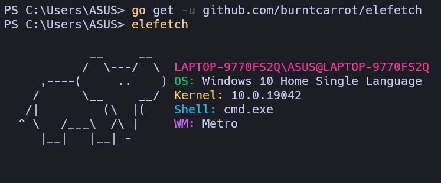

<div align = "center">
    <h1>elefetch</h1>
    <h4>🐘 Cross-platform, neofetch alternative for fetching system info.</h4>
    
</div>

## Installation
- go get:
  - `go get -u github.com/burntcarrot/elefetch`
- Binaries
  - Binaries are available under [Releases](https://github.com/burntcarrot/elefetch/releases).
- Easy, script-based installation
  ```bash
  curl -sfL https://github.com/burntcarrot/elefetch/raw/main/install.sh | bash
  ```

## Build from Source

```
git clone https://github.com/burntcarrot/elefetch
cd elefetch
go get -d ./...
go build
```

## License

`elefetch` is licensed under the [MIT License](LICENSE).
